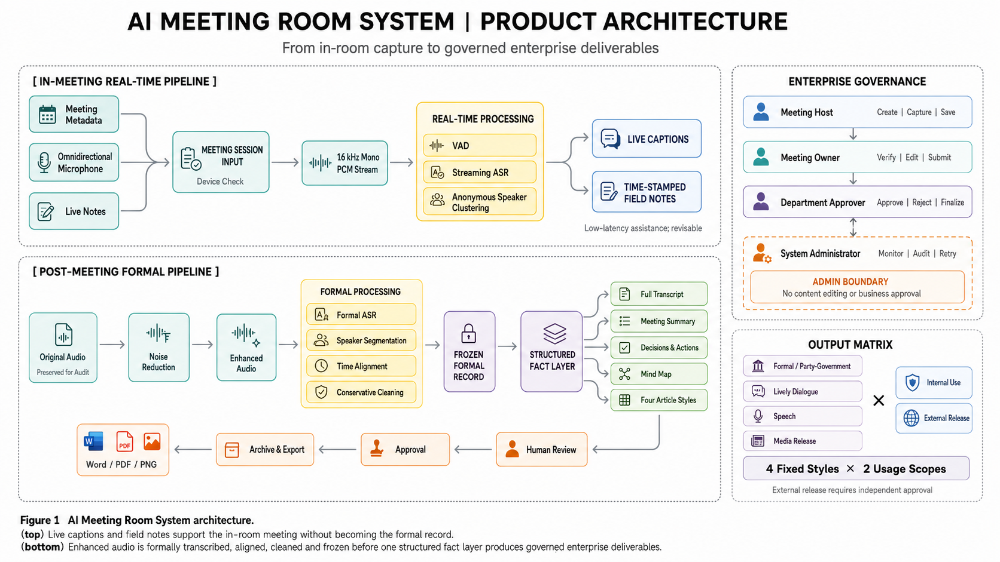
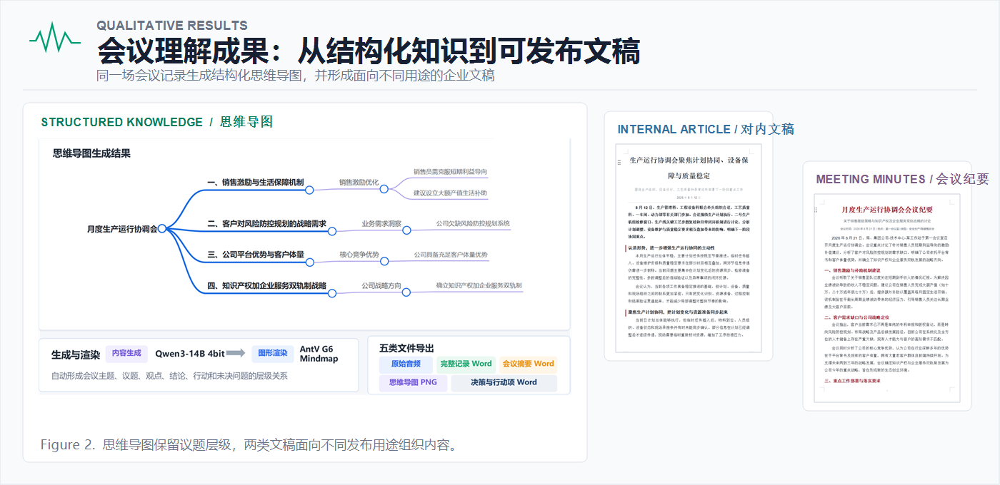

<p align="center">
  
</p>

<p align="center">
  
</p>

<h1 align="center">⚡ AI 会议室系统 🎙️</h1>

<p align="center"><strong>AI Meeting Room System</strong></p>

<p align="center"><em>面向企业内网会议的端到端 AI 会议治理系统</em></p>

<p align="center"><sub>真实会议室 · 企业内网 · 完整治理闭环 · 纯软件报价 15w+</sub></p>

<p align="center">
  
</p>

## 🎯 项目概览

主导面向企业单位，构建覆盖远场采集、实时转写、智能纪要、成果审批与归档的企业内部 AI 会议治理系统，最终纯软件报价15w+。

企业会议的难点不只在“把声音转成文字”，还包括远场噪声、多人说话人漂移、流式字幕抖动、会后精修、成果审批和归档追溯。本项目把这些环节组织成一条可恢复的内网工作流：

项目定位是一个“会议治理系统”，而不是单一 ASR Demo：前端负责采集和工作台体验，Go 服务负责鉴权、业务状态、审计与持久化，FastAPI 服务负责本地语音和语义模型编排。

<details>
<summary><strong>查看端到端链路</strong></summary>

```text
远场采集 → 双轨音频 → 实时字幕与说话人 → 会后稳定转写
                                      ↓
                    语义抽取 → 纪要/任务/思维导图 → 审批 → 归档
```

</details>

## 🆚 AI 会议室系统 vs 飞书 / 腾讯会议：核心差异

飞书、腾讯会议等产品主要解决线上协作与远程通话；本项目解决的是企业真实会议室中的多人共会、内网部署和会议成果治理。两者不是同一类产品，差异首先来自会议场景本身。

| 对比维度 | 常见线上会议 App | AI 会议室系统 |
| --- | --- | --- |
| 会议形态 | 一人一台设备，参会端相对独立 | 一台会议室设备，多人同时发言 |
| 声音处理 | 以单端采集和通话体验为主 | 必须处理远场噪声、插话、重叠发言和多人声纹聚类 |
| 数据部署 | 通常依赖云端会议服务 | 模型和后端部署在企业服务器，会议数据在内网闭环 |
| 组织治理 | 预约、入会和共享流程相对通用 | 按用户身份、部门和会议类型执行权限、审批与归档 |
| 成果形态 | 通用摘要、字幕和会议记录 | 面向生产、安全、成本等会议类型定制摘要、决策、行动项及对内/对外文章 |

> **一句话定位：** 飞书和腾讯会议解决“大家如何在线开会”，AI 会议室系统解决“企业如何把一场真实会议转化为可审核、可归档、可追溯的组织成果”。

<details>
<summary><strong>🔎 展开查看四类场景差异</strong></summary>

### 🏢 一人一台设备的线上会议 vs 一台设备的真实会议室

飞书、腾讯会议通常以“每人一台电脑或手机”的线上会议为基本单元，参会端相对独立；AI 会议室系统则是一台采集设备放在大会议室中，多人面对面共同参会，不要求每位参会者单独登录或携带设备。

这意味着系统必须直接理解真实会议室里的远场声音、多人同时发言、插话和发言距离变化，而不是只处理经过单端麦克风采集的通话音频。

### 🎙️ 通用通话体验 vs 会议室声学与说话人处理

线上会议 App 的核心目标是让远程参会者听清、看见并完成沟通；AI 会议室系统还要解决会议结束后“谁说了什么、什么时候说的、哪些内容形成了决策”的问题。

因此，本项目将 `DeepFilterNet3` 音频增强、`Paraformer Streaming` 实时转写、`Pyannote Community-1` 说话人分离、`CAM++` 在线声纹聚类和 `ERes2NetV2` 会后声纹精修组合成完整链路，专门应对噪声、重叠语音和多人标签漂移。

### 🛡️ 云端会议服务 vs 企业内网闭环

常见线上会议产品以云端服务为主要交付形态；本项目的模型服务、Go 后端、数据库和对象存储均可部署在企业服务器，会议音频、转写文本和成果文件在企业内网中完成处理。

这类部署方式面向的是不能把敏感会议直接交给公共平台处理的企业场景，重点是数据边界可控、服务可审计、权限可配置。

### 📋 通用会议记录 vs 按企业制度定制的治理成果

线上会议产品通常提供通用的预约、入会、字幕和摘要能力；真实企业会议还要区分生产会议、安全会议、成本讨论会议等不同类型，并根据用户身份、部门权限和会议用途执行审批与归档。

本项目的成果不是一份固定格式的摘要，而是根据会议类型生成会议摘要、决策、行动项、思维导图，以及面向内部或外部发布的不同风格文章，并纳入企业审批流程和版本归档。

</details>

### 🧩 核心能力

| 能力 | 说明 |
| --- | --- |
| 远场语音处理 | 保留原始音频与增强音频双轨，支持噪声场景下的后续复核 |
| 实时会议字幕 | 流式 ASR、稳定片段二次转写、标点后处理和降级 Provider |
| 说话人识别 | 在线 CAM++ 滚动聚类，会后 Pyannote + ERes2NetV2 精修 |
| 会议成果生成 | 摘要、行动项、文章、思维导图和结构化交付物 |
| 企业治理闭环 | 权限、审批、审计、归档、重试和任务状态可追溯 |

## 🧠 技术难点与设计逻辑

- **音频增强链路优化：** 针对设备噪声、空调底噪和远场收音导致的识别质量下降问题，接入 DeepFilterNet3，并保留原始音频与增强音频双轨；降噪 SNR、CER 和 DER 作为固定会议样本的后续评测指标。
- **模型适配与转写优化：** 针对政企会议中的专业术语、口音和流式字幕抖动问题，主导 Paraformer Streaming 与 Qwen3-ASR 1.7B 双阶段转写链路，通过术语词典、稳定片段二次转写、CT-Punc 后处理和 Provider 降级机制提升文本可读性；Qwen3-ASR 1.7B 对 10 秒音频单次推理约 **0.32–0.40 秒**，实时首段展示延迟 **1.47 秒**。
- **说话人聚类：** 针对多人会议中说话人标签跨窗口漂移的问题，主导 Pyannote Community-1 分离、CAM++ 声纹嵌入和会议内滚动聚类机制；通过 1.5 秒滑窗、0.75 秒步长和相似度阈值调优，解决同一发言人被重复拆分的问题。
- **AI 工作流可靠性：** 针对降噪、ASR、摘要和成果生成节点失败会阻塞整场会议的问题，设计 Provider 降级、结构化结果最多 **3 次即时重试**和 **15/30/60/120 秒**退避策略；将不同 AI 节点拆分为可恢复任务，避免单点失败扩散到整场会议。
- **企业交付与落地：** 针对敏感会议无法依赖公共平台处理的问题，主导 Electron 采集端、Windows 工作台和企业 Linux AI 后端的整体联调与部署，确保会议数据在企业内网闭环处理，保障会议的安全性。

## 📊 定性成果

<p align="center">
  
</p>

## 🏆 项目成果与企业价值

### 📦 交付成果

| 维度 | 结果 |
| --- | --- |
| 软件方案报价 | `15 万+`（纯软件方案报价口径） |
| 交付形态 | 采集端 + Web 工作台 + Go API + 企业 Linux AI 后端 |
| 核心闭环 | 采集、转写、说话人、纪要、审批、归档 |
| 数据边界 | 会议音频、文本和成果在企业内网闭环处理 |

### 💼 对企业的实际价值

- **数据可控：** 敏感会议数据不依赖公共 SaaS 托管，模型服务和对象存储可部署在企业内网。
- **减少人工交接：** 从录音、转写、纪要到成果审批由同一套任务链路串联，减少跨工具复制和人工同步。
- **过程可追溯：** 审批动作、版本、重试状态和归档结果保留在业务系统中，便于复核和责任追踪。
- **可扩展交付：** 模型 Provider、存储、数据库和前端工作台均有明确边界，便于按客户硬件和安全要求替换。

> 以上报价和价值描述来自项目交付口径；仓库不公开客户名称、组织结构、合同文本、回款信息或未经验证的 ROI 数字。

## 🤖 模型矩阵与下载入口

仓库不包含 `models/` 文件夹，也不分发模型权重。代码只引用部署时注入的外部模型目录；模型权重由部署方按许可、访问权限和硬件条件自行下载。下表中的路径是 **运行时挂载路径（仓库外）**，不是 GitHub 仓库内的目录。

| 阶段 | 模型 | 作用 | 运行时挂载路径（仓库外） | 公开入口 |
| --- | --- | --- | --- | --- |
| 音频增强 | DeepFilterNet3 | 远场降噪与增强 | `/models/enhancement/deepfilternet3` | [DeepFilterNet](https://github.com/Rikorose/DeepFilterNet) |
| 实时 ASR | Paraformer Streaming | 低延迟中文流式转写 | `/models/asr/paraformer-streaming` | [ModelScope Paraformer](https://modelscope.cn/models/iic/speech_paraformer-large_asr_nat-zh-cn-16k-common-vocab8404-online) |
| 会后 ASR | Qwen3-ASR 1.7B | 稳定转写与上下文修正 | `/models/asr/qwen3-asr-1.7b-qwen-asr` | [Qwen3-ASR](https://huggingface.co/Qwen/Qwen3-ASR-1.7B) |
| 词级对齐 | Qwen3 Forced Aligner 0.6B | 生成词级时间戳 | `/models/aligner/qwen3-forced-aligner-0.6b-qwen-asr` | [Qwen3-ForcedAligner](https://huggingface.co/Qwen/Qwen3-ForcedAligner-0.6B) |
| 会后分离 | pyannote Community-1 | 全量音频说话人分离 | `/models/diarization/pyannote-community-1` | [官方模型页](https://huggingface.co/pyannote/speaker-diarization-community-1) |
| 在线声纹 | CAM++ | 会议内匿名 speaker 聚类 | `/models/speaker/campplus` | [ModelScope CAM++](https://modelscope.cn/models/iic/speech_campplus_sv_zh-cn_16k-common) |
| 会后声纹 | ERes2NetV2 | 会后说话人嵌入 | `/models/speaker/eres2netv2` | [ModelScope ERes2NetV2](https://modelscope.cn/models/iic/speech_eres2netv2_sv_zh-cn_16k-common) |
| VAD | Silero VAD | 语音活动检测 | `/models/vad/silero-vad/silero_vad/data/silero_vad.onnx` | [Silero VAD](https://github.com/snakers4/silero-vad) |
| 语义生成 | Ollama `qwen3:14b` / `qwen3.6:35b` | 语义抽取、摘要与文章生成 | Ollama 服务地址由部署配置注入 | [Ollama Qwen3](https://ollama.com/library/qwen3) |

<details>
<summary><strong>📥 模型准备与挂载示例</strong></summary>

### 模型准备示例

以下命令只示范公开模型的下载方式。实际部署请先阅读模型卡片中的许可、访问申请、显存要求和商用限制，并将外部模型目录以只读方式映射到服务容器的 `/models`。

```bash
# 示例：宿主机目录不在仓库内，容器内统一挂载为 /models
docker run --rm -v /srv/meeting-models:/models:ro your-ai-service-image
```

例如，宿主机上的 `/srv/meeting-models/asr/paraformer-streaming` 会对应到容器内的 `/models/asr/paraformer-streaming`。这些路径仅用于部署时的模型挂载。

```bash
# ModelScope 示例：下载到本地缓存，再映射到 /models
modelscope download --model iic/speech_paraformer-large_asr_nat-zh-cn-16k-common-vocab8404-online
modelscope download --model iic/speech_campplus_sv_zh-cn_16k-common
modelscope download --model iic/speech_eres2netv2_sv_zh-cn_16k-common

# Qwen3 模型：可使用 Hugging Face / ModelScope 的官方权重
# pyannote Community-1：需要按模型页要求登录并接受使用条款

# Ollama 语义模型；语义客户端默认使用 qwen3:14b
ollama pull qwen3:14b

# 成果生成工作流默认读取 OLLAMA_DELIVERABLE_MODEL；项目记录中的默认标签为 qwen3.6:35b
# 请按实际 Ollama registry 中可用的模型标签准备，不要把私有模型地址提交到仓库
```

</details>

## ℹ️ 说明

- 本项目说明用于作品集展示和技术交流，不能直接替代生产部署方案。
- 运行前请检查模型许可、数据合规要求、GPU 驱动、数据库、对象存储和内网访问策略。
- 生产环境应通过环境变量或受控配置注入密钥，禁止把真实凭据写入代码、日志、迁移文件或提交历史。

## 🔗 参考链接

- [DeepFilterNet](https://github.com/Rikorose/DeepFilterNet)
- [FunASR / Paraformer](https://modelscope.cn/models/iic/speech_paraformer-large_asr_nat-zh-cn-16k-common-vocab8404-online)
- [Qwen3-ASR-1.7B](https://huggingface.co/Qwen/Qwen3-ASR-1.7B)
- [Qwen3-ForcedAligner-0.6B](https://huggingface.co/Qwen/Qwen3-ForcedAligner-0.6B)
- [pyannote Community-1](https://huggingface.co/pyannote/speaker-diarization-community-1)
- [Silero VAD](https://github.com/snakers4/silero-vad)
- [Ollama Qwen3](https://ollama.com/library/qwen3)
